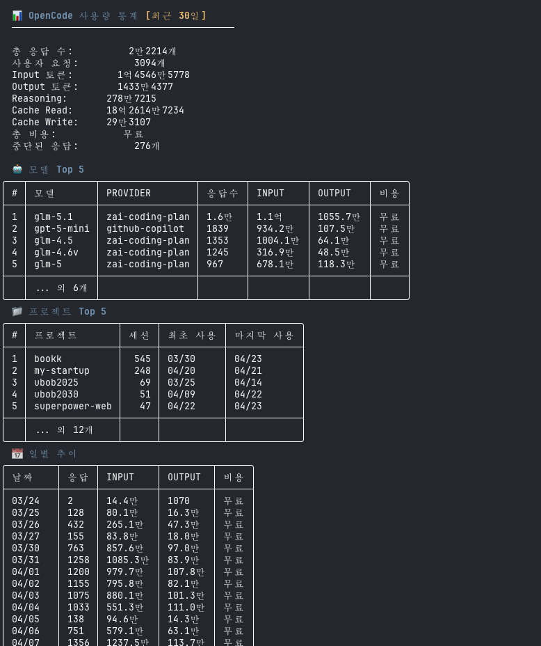

# oc-usage

OpenCode 사용량 통계를 터미널에서 조회하는 CLI 도구.

`~/.local/share/opencode/opencode.db` (SQLite)에서 데이터를 읽어 한국어 포맷팅된 테이블로 출력합니다.



## npm으로 설치

```bash
npm install -g @sigco3111/oc-usage
```

또는 npx로 실행:

```bash
npx @sigco3111/oc-usage
npx @sigco3111/oc-usage --period week
```

> 설치 시 플랫폼에 맞는 바이너리가 자동으로 다운로드됩니다.

| OS | Arch | 지원 |
|---|---|---|
| macOS (Apple Silicon) | arm64 | ✅ |
| Linux | amd64 | ✅ |
| Windows | amd64 | ✅ |

## 소스에서 빌드

```bash
cd opencode-usage && CGO_ENABLED=0 go build -o oc-usage .
```

## 삭제

```bash
npm uninstall -g @sigco3111/oc-usage
```

## 사용법

### 기본 실행 (최근 30일)

```bash
oc-usage
```

4개 섹션이 출력됩니다: 전체 요약, 모델별 TOP 5, 프로젝트별 TOP 5, 일별 추이 + 피크

### 기간 선택

```bash
oc-usage --period today
oc-usage --period week
oc-usage --period month    # 기본값
oc-usage --period all
oc-usage --from 2026-04-01 --to 2026-04-15
```

### 상세 보기

```bash
oc-usage --by-model      # 전체 모델 목록
oc-usage --by-day         # 일별 추이 + 누적 합계
oc-usage --by-project     # 전체 프로젝트 목록
oc-usage --by-hour        # 시간별 분포
oc-usage --by-agent       # 에이전트별 사용량
```

### JSON 출력

```bash
oc-usage --json
oc-usage --json --period week
```

### 기타 옵션

```bash
oc-usage --version
oc-usage --db-path /path/to/custom.db
oc-usage --color=never
oc-usage --color=always
```

## 요구사항

- OpenCode가 설치되어 있고 사용 이력이 있어야 함
- 소스 빌드 시 Go 1.21+ 필요

**DB 검색 경로** (자동 감지):

| OS | 검색 순서 |
|---|---|
| macOS / Linux | `~/.local/share/opencode/opencode.db` |
| Windows | `%LOCALAPPDATA%\opencode\opencode.db` → `%HOME%\.local\share\opencode\opencode.db` → `%APPDATA%\opencode\opencode.db` |

## License

MIT
